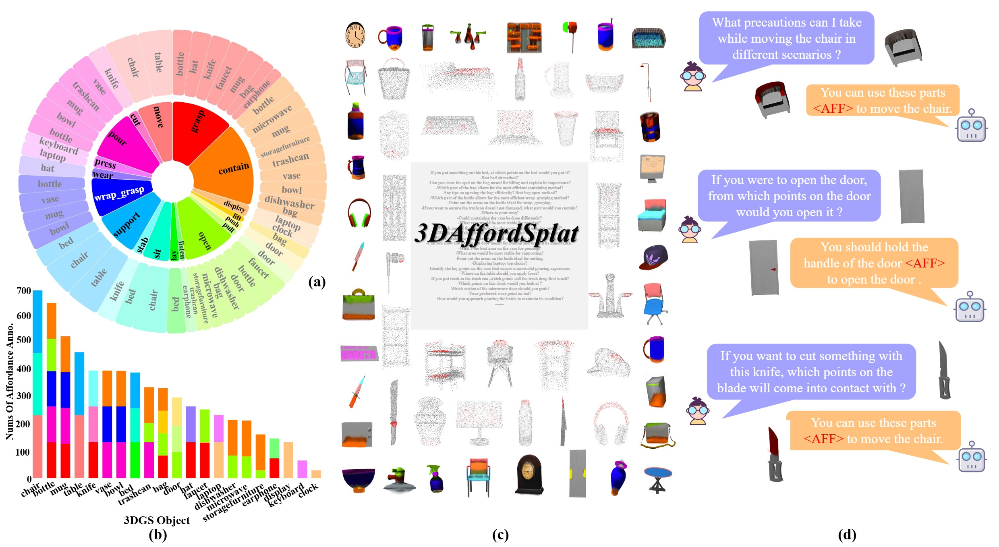
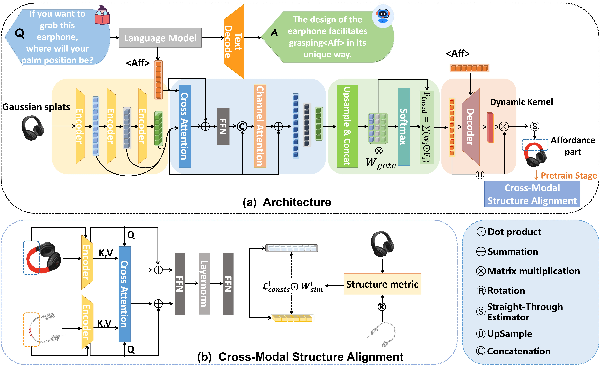

[]()
[]()
# 3DAffordSplat: Efficient Affordance Reasoning with 3D Gaussians
PyTorch implementation of "3DAffordSplat: Efficient Affordance Reasoning with 3D Gaussians". This repository contains PyTorch training, evaluation, inference code, the pretrained model and the 3DAffordSplat dataset.

## 📋 Table of content
 1. [💡 Abstract](#1)
 2. [📖 Method](#2)
 3. [📂 Dataset](#3)
 4. [📃 Requirements](#4)
 5. [✏️ Usage](#5)
    1. [Pretrain](#51)
    2. [Finetune](#52)
    3. [Inference](#53)
 6.  [✉️ Statement](#6)
 7.  [🔍 Citation](#7)
 8.  [👏 Acknowledgements](#8)


## 🍎 News: We have released the code!


## 💡 Abstract <a name="1"></a> 
3D affordance reasoning plays a critical role in associating human instructions with the functional regions of 3D objects, facilitating precise, task-oriented manipulations in embodied AI. However, current methods, which predominantly depend on sparse 3D point clouds, exhibit limited generalizability and robustness due to their sensitivity to coordinate variations and the inherent sparsity of the data. By contrast, 3D Gaussian Splatting (3DGS) delivers high-fidelity, real-time rendering with minimal computational overhead by representing scenes as dense, continuous distributions. This positions 3DGS as a highly effective approach for capturing fine-grained affordance details and improving recognition accuracy. Nevertheless, its full potential remains largely untapped due to the absence of large-scale, 3DGS-specific affordance datasets. To overcome these limitations, we present **3DAffordSplat**, the first large-scale, multi-modal dataset tailored for 3DGS-based affordance reasoning. This dataset includes 23,677 Gaussian instances, 8,354 point cloud instances, and 6,631 manually annotated affordance labels, encompassing 21 object categories and 18 affordance types. Building upon this dataset, we introduce **AffordSplatNet**, a novel model specifically designed for affordance reasoning using 3DGS representations. AffordSplatNet features an innovative cross-modal structure alignment module that exploits structural consistency priors to align 3D point cloud and 3DGS representations, resulting in enhanced affordance recognition accuracy. Extensive experiments demonstrate that the 3DAffordSplat dataset significantly advances affordance learning within the 3DGS domain, while AffordSplatNet consistently outperforms existing methods across both seen and unseen settings, highlighting its robust generalization capabilities. 

<p align="center">
     <br />
    <em> 
    </em>
</p>

**3DAffordSplat.** We introduce 3DAffordSplat, the first large-scale, multi-modal 3DGS-based Affordance Reasoning with comprehensive affordance annotations, comprising Gaussian, point cloud, and textual instruction modalities.


## 📖 Method <a name="2"></a> 
### AffordSplatNet
<p align="center">
     <br />
    <em> 
    </em>
</p>

**Novel 3DGS-based affordance reasoning model.** We propose a novel 3DGS-based affordance reasoning model, AffordSplatNet, that enables effective knowledge transfer between point cloud and Gaussian representations, improving affordance reasoning accuracy and robustness.


## 📂 Dataset <a name="3"></a> 
**Examples of 3DAffordSplat.** Some annotated examples of 3DAffordSplat are shown below, showing the meticulous annotation quality of 3DAfferdSplat.
<p align="center">
     <br />
    <em> 
    </em>
</p>

### Dataset Setup
The full set of object-affordance pairs are stored in [obj_aff_structure.json](AffordSplat/obj_aff_structure.json). For UnSeen setting, the object-afforance pairs are stored in [UnSeen_train.json](AffordSplat/UnSeen_train.json) and [UnSeen_test.json](AffordSplat/UnSeen_test.json).

You can download the AffordSplat dataset from [huggingface](https://huggingface.co/datasets/Weizm/AffordSplat), [Google Drive]() (coming soon), [Baidu](https://pan.baidu.com/s/1CH5cq_haOz8jXtjsZZAodw?pwd=x9j7) and [ModelScope]() (coming soon). The dataset should be placed in the `3DAfferdSplat` folder of the project. 

Afterward, the `3DAfferdSplat` folder structure should be as follows:
```
3DAffordSplat
├── Seen
│   ├── train
│   │   ├── bag
│   │   │   ├── Gaussian
│   │   │   │   ├── GS_0017.ply
│   │   │   │   ├── ...
│   │   │   ├── PointCloud
│   │   │   │   ├── PC_0001.ply
│   │   │   │   ├── ...
│   │   │   ├── contain
│   │   │   │   ├── GS_anno_0017.ply
│   │   │   │   ├── PC_anno_0001.json
│   │   │   │   ├── ...
│   │   │   └── grasp
│   │   │       ├── ...
│   │   └── bed
│   │       ├── ...
│   ├── val
│   │   ├── bag
│   │   │   ├── Gaussian
│   │   │   │   ├── GS_0009.ply
│   │   │   │   ├── ...
│   │   │   ├── contain
│   │   │   │   ├── GS_anno_0009.ply
│   │   │   │   ├── ...
│   │   │   └── grasp
│   │   │       ├── ...
│   │   └── bed
│   │       ├── ...
│   └── test
│       ├── bag
│       │   ├── Gaussian
│       │   │   ├── GS_0001.ply
│       │   │   ├── ...
│       │   ├── contain
│       │   │   ├── GS_anno_0001.ply
│       │   │   ├── ...
│       │   └── grasp
│       │       ├── ...
│       └── bed
│           ├── ...
├── Affordance-Question.csv
├── obj_aff_structure.json
├── UnSeen_test.json
└── UnSeen_train.json
```
More detailed informations can be find in [3DAffordSplat](https://arxiv.org/abs/2504.11218).

## 📃 Requirements <a name="4"></a> 
Before you start, please ensure your system meets the following requirements:
- PyTorch  2.5.1
- Python  3.12(ubuntu22.04)
- CUDA  12.4
- RTX 4090(24GB) * 4
  
### Installation Steps
1. Install Project Dependencies
```bash
conda create -n AffordSplat python=3.12
conda activate AffordSplat
pip install -r requirements.txt
```


## ✏️ Usage <a name="5"></a> 
**Pretrain** <a name="51"></a> 
```
sh pretrain.sh
```

**Finetune** <a name="52"></a> 

To fine-tune the model using pre-trained weights, follow these steps:
1. Locate the `train_config.yaml` file in the `config` directory.
2. Modify the `finetune` section as follows:
   ```
   finetune:
     is_resume: True
     ckpt_path: /path/to/pretrained/weights.pth
   ```
3. Run the fine-tuning script:
   ```
   sh finetune.sh
   ```

**Inference** <a name="53"></a> 

To perform inference using the trained model, follow these steps:
1. Locate the `train_config.yaml` file in the `config` directory.
2. Modify the `inference` section as follows:
   ```
   inference:
     ckpt_path: /path/to/trained/weights.pth
   ```
3. Run the inference script:
   ```
   sh inference.sh
   ```
   
We have provided an additional `utils/get_ply_result.py` file to help to obtain visualization results.


## ✉️ Statement <a name="6"></a> 
This project is for research purpose only, please contact us for the licence of commercial use. For any other questions please contact (weizm6@mail2.sysu.edu.cn, linjy279@mail2.sysu.edu.cn or liuy856@mail.sysu.edu.cn).

## 🔍 Citation <a name="7"></a> 

```
@misc{wei20253daffordsplatefficientaffordancereasoning,
      title={3DAffordSplat: Efficient Affordance Reasoning with 3D Gaussians}, 
      author={Zeming wei and Junyi Lin and Yang Liu and Weixing Chen and Jingzhou Luo and Guanbin Li and Liang Lin},
      year={2025},
      eprint={2504.11218},
      archivePrefix={arXiv},
      primaryClass={cs.CV},
      url={https://arxiv.org/abs/2504.11218}, 
}
```

## 👏 Acknowledgements <a name="8"></a> 
- [3DAffordanceNet](https://github.com/Gorilla-Lab-SCUT/AffordanceNet), [LASO](https://github.com/yl3800/laso) and [ShapeSplat](https://huggingface.co/datasets/ShapeSplats/ModelNet_Splats): The construction of AffordSplat dataset is based on these works. 
- [SuperSplat](https://playcanvas.com/supersplat/editor): We performed our data annotation using this excellent platform.

We sincerely thank Guantian Liu, Yao Xiao, Xinyu Li, Kecheng Liang and Yipeng Ouyang for their contributions.
